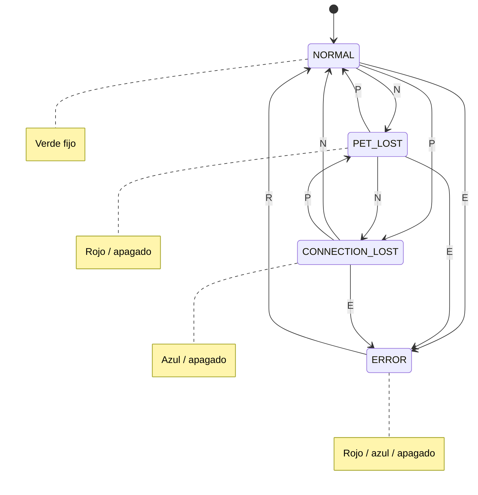
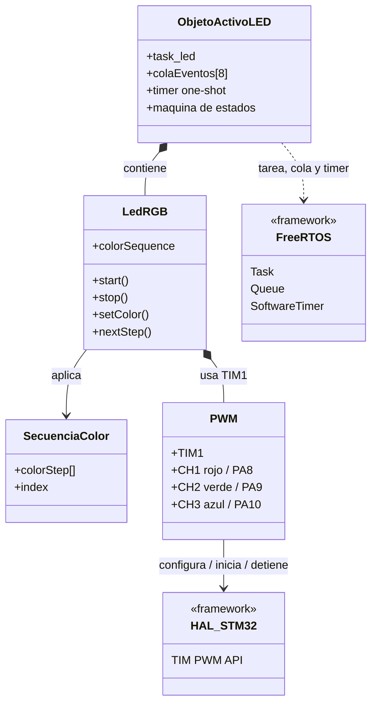
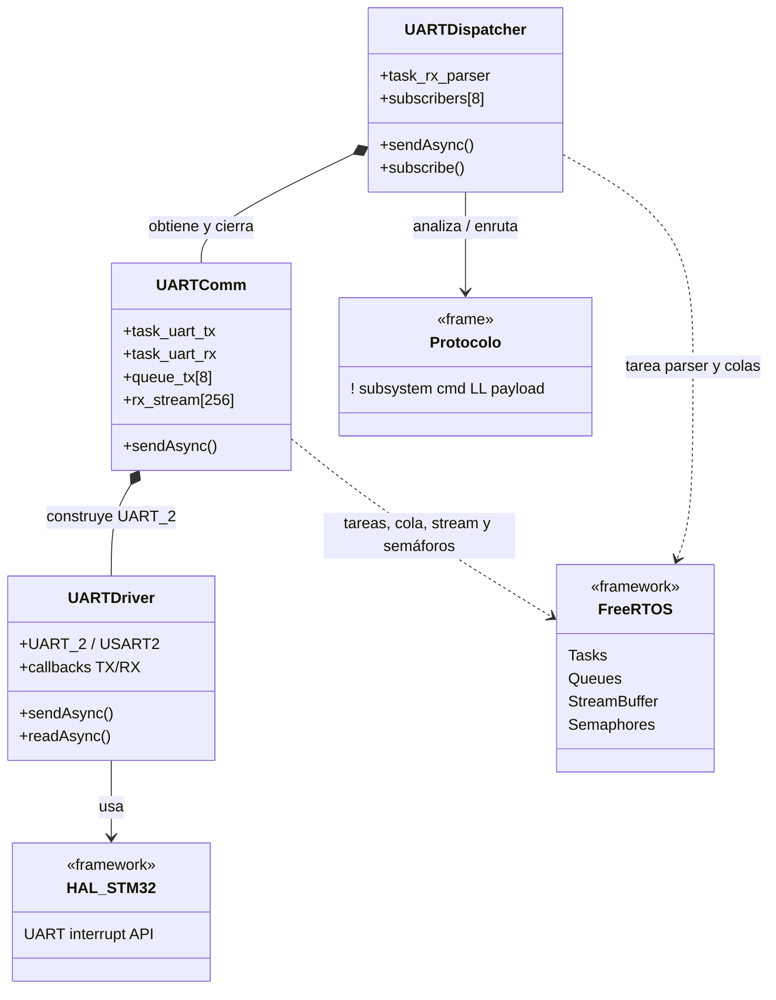

# ingSW-UBA

Firmware para una STM32F446RE desarrollado como trabajo práctico de la materia
Ingeniería de Software para Sistemas Embebidos. La aplicación modela el estado
de un dispositivo de seguimiento y lo comunica visualmente mediante un LED RGB.
Los cambios de estado se solicitan a través de UART y se procesan de manera no
bloqueante con FreeRTOS.

## Descripción del proyecto

El sistema integra tres capas principales:

- La aplicación recibe comandos destinados al subsistema LED RGB y administra
  la máquina de estados general.
- El objeto activo del LED RGB aplica una secuencia de colores usando PWM.
- El servicio UART recibe, valida y despacha tramas del protocolo serie, y
  transmite las respuestas generadas por la aplicación.

El LED de estado usa `TIM1`: PA8/CH1 para rojo, PA9/CH2 para verde y PA10/CH3
para azul. La comunicación serie se realiza por `USART2` (`UART_2`) a 115200,
8N1, mediante PA2 (TX) y PA3 (RX).

## Máquina de estados de la aplicación

La máquina, implementada en [`app.c`](ingSw/Core/Src/app.c), inicia en
`NORMAL`. Cada transición válida actualiza la secuencia del LED y transmite una
respuesta de estado (`S`). En `ERROR` únicamente se acepta el comando de
recuperación (`R`).



## Módulo LED RGB

El módulo [`ledRgb`](ingSw/bsp/ledRgb/ledRgb.c) controla los tres canales PWM
del LED. Permite definir secuencias ordenadas de pasos RGB (intensidad de 0 a
255 y duración en milisegundos), seleccionar un paso y avanzar de manera
cíclica. El objeto activo asociado recibe los eventos `OFF`, `ON` y `BLINK` en
una cola privada y ejecuta la secuencia sin bloquear la aplicación. La
polaridad PWM se adapta a conexiones de ánodo o cátodo común.

Diagrama de alto nivel reutilizado de [`doc/req.md`](doc/req.md):



## Módulo UART

El módulo [`uartComm`](ingSw/Services/uartComm/uartComm.c) encapsula el driver
de UART y ofrece recepción y transmisión asíncronas. Una tarea de TX conserva
el orden de una cola de hasta ocho mensajes; otra tarea de RX pasa los datos
recibidos a un buffer de flujo de 256 bytes. Las interrupciones de finalización
señalizan semáforos, por lo que no bloquean las tareas de aplicación.

El [`uartDispatcher`](ingSw/Services/dispatcher/uartDispatcher.c) consume ese
buffer, reconstruye las tramas y las entrega a los suscriptores del subsistema
correspondiente. Puede registrar hasta ocho suscriptores. Las tramas para el
subsistema de prueba de comunicaciones se reenvían como eco.

Diagrama de alto nivel reutilizado de [`doc/req.md`](doc/req.md):



## Protocolo serie

Cada trama sigue el formato siguiente, sin separadores ni terminador:

```
!<subsistema><comando><LL><payload>
```

| Campo | Tamaño | Descripción |
| --- | ---: | --- |
| `!` | 1 byte | Byte de inicio de trama. |
| `subsistema` | 1 byte | Identificador ASCII del destinatario. El LED RGB usa `1`. |
| `comando` | 1 byte | Operación solicitada. |
| `LL` | 2 bytes | Longitud decimal de `payload`, de `00` a `59`. |
| `payload` | 0 a 59 bytes | Datos opcionales definidos por el comando. |

El parser descarta tramas con longitud no numérica, longitud mayor a 59 bytes o
subsistema inválido; luego vuelve a buscar el byte `!` para sincronizarse otra
vez. El tamaño total máximo de una trama es de 64 bytes.

Ejemplo: `!1N00` solicita el siguiente estado para el subsistema LED RGB.

## Comandos disponibles

Todos los comandos de aplicación se envían al subsistema LED RGB (`1`) y no
llevan payload.

| Trama a enviar | Comando | Efecto |
| --- | --- | --- |
| `!1N00` | `N` | Avanza al siguiente estado: `NORMAL → PET_LOST → CONNECTION_LOST → NORMAL`. |
| `!1P00` | `P` | Vuelve al estado anterior dentro del mismo ciclo. |
| `!1E00` | `E` | Entra en `ERROR` desde cualquier estado que no sea `ERROR`. |
| `!1R00` | `R` | Recupera el sistema de `ERROR` y vuelve a `NORMAL`. |

Ante una transición válida, el firmware responde con una trama `!1SLL<estado>`.
Por ejemplo, al entrar en `PET_LOST` responde `!1S08PET_LOST`.

